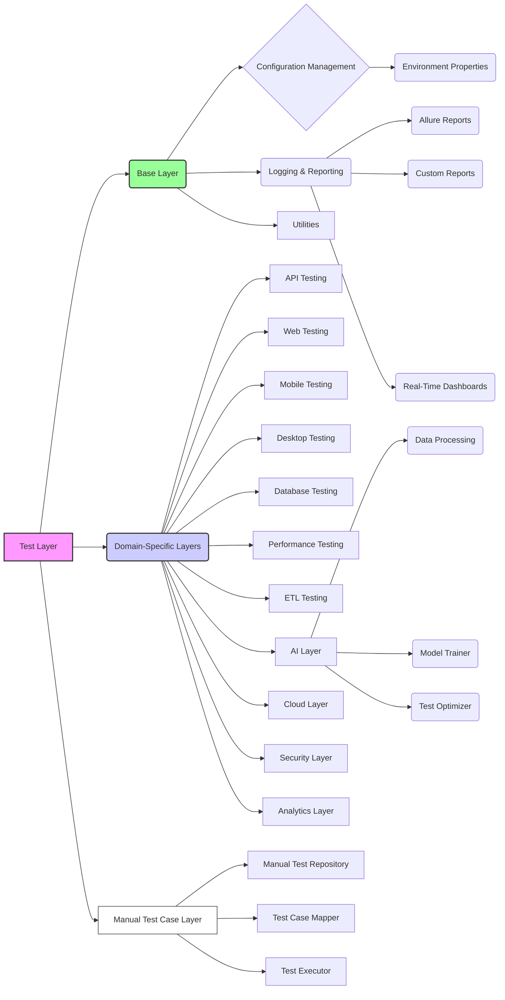
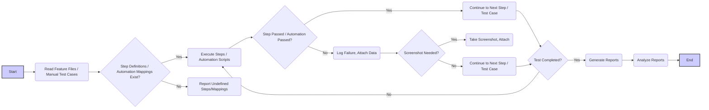

# SAWMPED-AATUMATION Test Framework: Enterprise Edition - Complete Documentation

## Introduction

This document provides a comprehensive guide to the Hybrid-BDD-API-Test-Framework: Enterprise Edition, a sophisticated and scalable test automation solution designed for modern organizations. This framework supports a wide range of testing domains, including Web, API, Mobile, Desktop, Database, Performance, ETL, Security, AI, and Cloud, all while integrating manual test cases. It's engineered to maximize flexibility, maintainability, and actionable insights.

## Components of SAWMPED-AATUMATION Test Framework:

### 1. **System/Software Testing (S)**
   - Ensures the functionality, reliability, and quality of entire systems or software applications.
   - **Key Features:**
     - End-to-end testing.
     - Integration with CI/CD pipelines.
     - Customizable test scenarios for specific system requirements.

### 2. **API Testing (A)**
   - Validates the functionality, performance, and security of APIs.
   - **Key Features:**
     - Support for REST, SOAP, and GraphQL APIs.
     - Automated generation of test cases.
     - Response validation and schema checks.
     - Integration with tools like Postman and Swagger.

### 3. **Web Testing (W)**
   - Covers testing of web applications to ensure they are functional, responsive, and secure.
   - **Key Features:**
     - Cross-browser testing.
     - Support for Selenium WebDriver.
     - Visual regression testing.
     - Accessibility and usability checks.

### 4. **Mobile Testing (M)**
   - Focuses on testing mobile applications on Android and iOS platforms.
   - **Key Features:**
     - Integration with Appium for mobile automation.
     - Real device and emulator support.
     - Compatibility and performance testing.

### 5. **Performance Testing (P)**
   - Evaluates the system's performance under load and stress conditions.
   - **Key Features:**
     - Integration with JMeter and Gatling.
     - Load testing for APIs and web applications.
     - Detailed performance metrics and reporting.

### 6. **ETL Testing (E)**
   - Ensures the accuracy and integrity of data during ETL processes.
   - **Key Features:**
     - Validation of data transformations and mappings.
     - Integration with DBUnit for database comparisons.
     - Automated testing for large datasets.

### 7. **Database Testing (D)**
   - Focuses on verifying the consistency, integrity, and reliability of database systems.
   - **Key Features:**
     - Schema validation.
     - Data integrity checks.
     - SQL query optimization and performance testing.

### 8. **Desktop Testing**
   - Ensures the quality and performance of desktop applications across Windows, Mac, and Linux platforms.
   - **Key Features:**
     - Integration with Appium for desktop automation.
     - Support for AutoIt scripting.
     - Comprehensive actions and capabilities for Windows, Mac, and Linux.
     - Modular design for utilities and page objects.

## This README includes:

-   **Architectural Overview:** A thorough conceptual explanation of the framework's design principles.
-   **Visual Aids:**
    -   Project Structure Tree Diagram: A visual representation of the project's directory structure.
    -   Component Diagram: A high-level overview of the main components and their interactions.
    -   Workflow Diagram: A step-by-step depiction of the test execution process.
-   **Detailed Component Descriptions:** In-depth explanations of each component's role.
-   **Practical Guidance:** Detailed instructions on setting up, configuring, and running the framework.
-   **Technology Stack:** A comprehensive list of the technologies and tools used.
-   **Advanced Features:** An in-depth look at containerization, AI integration, reporting, and manual test case integration.
-   **Manual Test Case Repository & Mapping**: Detail instruction on how to integrate manual test cases.

## Core Design Principles

The framework is built upon the following core design principles:

1.  **Behavior-Driven Development (BDD):**
    *   **Principle:** Test scenarios are written in a natural language format using Gherkin syntax, encouraging collaboration between technical and non-technical team members. Tests focus on the 'what' rather than the 'how'.
    *   **Implementation:** Cucumber is used for parsing feature files and mapping them to executable code in step definitions.
    *   **Impact:** Enhances test clarity, reduces ambiguity, and promotes user-focused test coverage.

2.  **Layered Architecture:**
    *   **Principle:** The framework is structured into distinct layers, each handling a specific set of responsibilities.
    *   **Implementation:** The layers include:
        *   **Base Layer:** Contains core functionalities such as configuration loading, logging, reporting, and environment management.
        *   **Domain-Specific Layers:** Provides domain-specific functionalities for API, Web, Mobile, Desktop, Database, Performance, ETL, AI, Cloud, Security, Analytics, and Reporting.
        *   **Manual Test Case Layer**: Manages manual test case, provides mapping and execution functionalities.
        *   **Test Layer:** Holds test cases, step definitions, and feature files, orchestrating test execution.
    *   **Impact:** Improves code organization, promotes maintainability, scalability, and modular design.

3.  **Modularity and Extensibility:**
    *   **Principle:** The framework is designed to be modular, allowing easy replacement or addition of components with minimal impact on the overall structure.
    *   **Implementation:** Utilizes abstract classes, interfaces, and helper classes for specific domain interactions.
    *   **Impact:** Streamlines maintenance, adapts to new testing requirements, and encourages code reuse.

4.  **Environment Abstraction:**
    *   **Principle:** Abstracts the testing environment from the test logic, allowing tests to run across different environments with minimal changes.
    *   **Implementation:** The `EnvironmentManager` loads configurations from external `.properties` files specific to each environment.
    *   **Impact:** Minimizes test duplication and provides flexible deployment contexts.

5.  **Containerization:**
    *   **Principle:** Containerization of the framework and all its components, including browser drivers, using Docker.
    *   **Implementation:** Separate Dockerfiles for each browser and the framework, managed within Docker containers along with their dependencies.
    *   **Impact:** Ensures consistent and isolated test environments, and simplifies deployment and dependency management.

6.  **AI-Driven Testing:**
    *   **Principle:** Leverage AI and ML for enhanced test execution, and intelligent analysis.
    *   **Implementation:** AI is used for test case generation, test prioritization, detection of flaky tests, and AI-driven reporting.
    *   **Impact:** Improves efficiency, provides deeper analysis, and increases the overall quality of testing.

7.  **Manual Test Case Integration:**
    *   **Principle:** The framework integrates manual test cases by providing a mechanism to manage and map manual test cases with their automated scripts.
    *   **Implementation**: Provides support to manage manual test cases, maps them with automated scripts, and executes them.
    *   **Impact**: Improves test case coverage by linking manual test cases with automated scripts. It also helps in converting the manual test cases into automated test scripts.

## Project Structure Tree Diagram

```
SAWMPED-AATUMATION
├── src
│   ├── main
│   │   └── java
│   │       └── com
│   │           └── framework
│   │               ├── Main.java
│   │               ├── ai
│   │               │   └── generator
│   │               │       ├── BDDScenarioGenerator.java
│   │               │       └── TestCaseGenerator.java
│   │               │   └── ml
│   │               │       ├── DataPreprocessor.java
│   │               │       ├── MLModelTrainer.java
│   │               │       └── ModelManager.java
│   │               │   └── optimization
│   │               │       ├── FailurePrediction.java
│   │               │       ├── FlakyTestDetector.java
│   │               │       └── TestPrioritization.java
│   │               ├── analytics
│   │               │   └── integration
│   │               │       ├── GrafanaIntegration.java
│   │               │       └── KibanaIntegration.java
│   │               │   └── visualizations
│   │               │       ├── MetricCollector.java
│   │               │       └── TrendAnalyzer.java
│   │               ├── api
│   │               │   ├── ApiConfig.java
│   │               │   ├── ApiRequestHandler.java
│   │               │   ├── ApiVariableManager.java
│   │               │   ├── AuthManager.java
│   │               │   ├── DeleteRequest.java
│   │               │   ├── GetRequest.java
│   │               │   ├── HeaderManager.java
│   │               │   ├── PatchRequest.java
│   │               │   ├── PostRequest.java
│   │               │   ├── PostRequestScript.java
│   │               │   ├── PreRequestScript.java
│   │               │   ├── PutRequest.java
│   │               │   └── SessionManager.java
│   │               ├── base
│   │               │   ├── ApiConfig.java
│   │               │   ├── BaseTest.java
│   │               │   ├── DataProvider.java
│   │               │   ├── HTMLReportGenerator.java
│   │               │   ├── LogManager.java
│   │               │   ├── Operations.java
│   │               │   └── PropertiesFileReader.java
│   │               ├── cloud
│   │               │   └── config
│   │               │       └── CloudTestingConfig.java
│   │               │   └── executors
│   │               │       ├── AWSDeviceFarmExecutor.java
│   │               │       ├── BrowserStackExecutor.java
│   │               │       └── SauceLabsExecutor.java
│   │               │   └── utils
│   │               │       └── CloudServiceUtils.java
│   │               ├── database
│   │               │   ├── DatabaseConfig.java
│   │               │   ├── DBAssertions.java
│   │               │   ├── DBConnectionManager.java
│   │               │   ├── DBTestHelper.java
│   │               │   ├── DBTestRunner.java
│   │               │   └── DBUnitHelper.java
│   │               ├── desktop
│   │               │   └── appium
│   │               │       ├── AppiumDesktopBaseTest.java
│   │               │       ├── AppiumDesktopDriverFactory.java
│   │               │       ├── DesktopAppUtils.java
│   │               │       ├── DesktopPageObjects.java
│   │               │       ├── DesktopTestConfig.java
│   │               │       ├── DesktopTestHelper.java
│   │               │       ├── LinuxActions.java
│   │               │       ├── LinuxCapabilities.java
│   │               │       ├── LinuxPageObjects.java
│   │               │       ├── MacActions.java
│   │               │       ├── MacCapabilities.java
│   │               │       ├── MacPageObjects.java
│   │               │       ├── WindowsActions.java
│   │               │       ├── WindowsCapabilities.java
│   │               │       └── WindowsPageObjects.java
│   │               │   └── autoit
│   │               │       ├── AutoItHelper.java
│   │               │       ├── AutoItScriptGenerator.java
│   │               │       └── AutoItUtils.java
│   │               ├── drivers
│   │               │   ├── CloudDriverManager.java
│   │               │   ├── DriverFactory.java
│   │               │   └── enums
│   │               │       ├── BrowserType.java
│   │               │       └── OSPlatform.java
│   │               │   └── WebDriverManager.java
│   │               ├── etl
│   │               │   ├── ETLConfig.java
│   │               │   ├── ETLDataTransformValidator.java
│   │               │   ├── ETLDataValidator.java
│   │               │   ├── ETLTestExecutor.java
│   │               │   ├── ETLTestHelper.java
│   │               │   ├── ETLTestReporter.java
│   │               │   ├── ETLTestSteps.java
│   │               │   └── ExtractTransformLoadTest.java
│   │               ├── helpers
│   │               │   ├── BaseHelper.java
│   │               │   ├── BrowserUtils.java
│   │               │   ├── FileUtils.java
│   │               │   ├── UIHelpers.java
│   │               │   ├── WaitUtils.java
│   │               │   └── WebDriverHelper.java
│   │               ├── listeners
│   │               │   ├── AllureListener.java
│   │               │   └── TestListener.java
│   │               ├── manualtestcases
│   │               │   ├── ManualTestCaseManager.java
│   │               │   ├── TestCaseData.java
│   │               │   ├── TestCaseMapper.java
│   │               │   └── TestExecutor.java
│   │               ├── mobile
│   │               │   └── appium
│   │               │       ├── AndroidActions.java
│   │               │       ├── AndroidCapabilities.java
│   │               │       ├── AndroidPageObjects.java
│   │               │       ├── AppiumBaseTest.java
│   │               │       ├── AppiumDriverFactory.java
│   │               │       ├── IosActions.java
│   │               │       ├── IosCapabilities.java
│   │               │       ├── IosPageObjects.java
│   │               │       ├── MobileAppUtils.java
│   │               │       ├── MobilePageObjects.java
│   │               │       ├── MobileTestConfig.java
│   │               │       └── MobileTestHelper.java
│   │               ├── pageFactory
│   │               │   └── login
│   │               │       ├── LoginPageLocators.java
│   │               │       └── LoginPageOperations.java
│   │               │   └── signup
│   │               │       ├── SignUpPageLocators.java
│   │               │       └── SignUpPageOperations.java
│   │               ├── pageObject
│   │               │   └── login
│   │               │       └── LoginPage.java
│   │               │   └── signup
│   │               │       └── SignUpPage.java
│   │               ├── performance
│   │               │   ├── JMeterConfig.java
│   │               │   ├── JMeterTestExecutor.java
│   │               │   ├── JMeterTestResultParser.java
│   │               │   ├── LoadTestScenario.java
│   │               │   ├── PerformanceMetricsCollector.java
│   │               │   ├── PerformanceTestHelper.java
│   │               │   ├── PerformanceTestReporter.java
│   │               │   └── StressTestScenario.java
│   │               ├── reporting
│   │               │   └── generators
│   │               │       ├── AIReportGenerator.java
│   │               │       └── TestSummaryReport.java
│   │               │   └── parsers
│   │               │       ├── JSONReportParser.java
│   │               │       ├── ReportParser.java
│   │               │       └── XMLReportParser.java
│   │               ├── security
│   │               │   └── reports
│   │               │       ├── CodeQualityReport.java
│   │               │       └── SecurityScanReport.java
│   │               │   └── scanners
│   │               │       ├── OWASPSecurityScanner.java
│   │               │       ├── SonarQubeScanner.java
│   │               │       └── StaticCodeAnalyzer.java
│   │               ├── supportLibraries
│   │               │   ├── DataReader.java
│   │               │   ├── ExecutionStatusUtility.java
│   │               │   └── LoggerUtility.java
│   │               └── utils
│   │                   ├── ai
│   │                   │   ├── AIModelUtils.java
│   │                   │   ├── DataProcessingUtils.java
│   │                   │   └── MLUtils.java
│   │                   ├── analytics
│   │                   │   ├── LogAnalyticsUtils.java
│   │                   │   └── MetricsUtils.java
│   │                   ├── api
│   │                   │   └── ApiUtils.java
│   │                   ├── cloud
│   │                   │   ├── CloudIntegrationUtils.java
│   │                   │   └── CloudStorageUtils.java
│   │                   ├── common
│   │                   │   ├── DateUtils.java
│   │                   │   ├── ExcelUtils.java
│   │                   │   ├── FileUtils.java
│   │                   │   ├── JsonUtils.java
│   │                   │   ├── StringUtils.java
│   │                   │   └── XmlUtils.java
│   │                   ├── database
│   │                   │   ├── DbUtils.java
│   │                   │   └── SqlQueryBuilder.java
│   │                   ├── etl
│   │                   │   └── EtlUtils.java
│   │                   ├── mobile
│   │                   │   ├── AppiumUtils.java
│   │                   │   └── MobileUtils.java
│   │                   ├── notifications
│   │                   │   ├── EmailUtils.java
│   │                   │   ├── SlackUtils.java
│   │                   │   └── WebhookUtils.java
│   │                   ├── performance
│   │                   │   └── JMeterUtils.java
│   │                   ├── reporting
│   │                   │   ├── ReportUtils.java
│   │                   │   └── SummaryUtils.java
│   │                   ├── security
│   │                   │   ├── EncryptionUtils.java
│   │                   │   └── HashUtils.java
│   │                   ├── serialization
│   │                   │   ├── CsvSerializationUtils.java
│   │                   │   ├── JsonSerializationUtils.java
│   │                   │   └── XmlSerializationUtils.java
│   │                   ├── utilities
│   │                   │   ├── MemoryUtils.java
│   │                   │   ├── NetworkUtils.java
│   │                   │   └── ThreadUtils.java
│   │                   ├── validation
│   │                   │   ├── AssertionUtils.java
│   │                   │   ├── DataValidationUtils.java
│   │                   │   └── SchemaValidatorUtils.java
│   │                   └── web
│   │                       ├── BrowserUtils.java
│   │                       ├── WaitUtils.java
│   │                       └── WebDriverUtils.java
│   └── resources
│       ├── configuration
│       │   ├── ai
│       │   │   ├── ai-config.ini
│       │   │   └── ai-config.properties
│       │   ├── api
│       │   │   ├── api-config.ini
│       │   │   └── api-config.properties
│       │   ├── cloud
│       │   │   ├── cloud-config.ini
│       │   │   └── cloud-config.properties
│       │   ├── config.ini
│       │   ├── config.properties
│       │   ├── database
│       │   │   ├── database-config.ini
│       │   │   └── database-config.properties
│       │   ├── desktop
│       │   │   ├── desktop-config.ini
│       │   │   └── desktop-config.properties
│       │   ├── environments
│       │   │   ├── dev
│       │   │   │   ├── dev.ini
│       │   │   │   └── dev.properties
│       │   │   ├── environment.ini
│       │   │   ├── environment.properties
│       │   │   ├── other
│       │   │   │   ├── other.ini
│       │   │   │   └── other.properties
│       │   │   ├── prod
│       │   │   │   ├── prod.ini
│       │   │   │   └── prod.properties
│       │   │   ├── qa
│       │   │   │   ├── qa.ini
│       │   │   │   └── qa.properties
│       │   │   ├── staging
│       │   │   │   ├── staging.ini
│       │   │   │   └── staging.properties
│       │   │   └── uat
│       │   │       ├── uat.ini
│       │   │       └── uat.properties
│       │   ├── etl
│       │   │   ├── etl-config.ini
│       │   │   └── etl-config.properties
│       │   ├── manualtestcase
│       │   │   ├── manualtestcase-config.ini
│       │   │   └── manualtestcase-config.properties
│       │   ├── mobile
│       │   │   ├── mobile-config.ini
│       │   │   └── mobile-config.properties
│       │   ├── performance
│       │   │   ├── performance-config.ini
│       │   │   └── performance-config.properties
│       │   ├── report
│       │   │   ├── report-config.ini
│       │   │   └── report-config.properties
│       │   ├── security
│       │   │   ├── security-config.ini
│       │   │   └── security-config.properties
│       │   └── webui
│       │       ├── webui-config.ini
│       │       └── webui-config.properties
│       └── testdata
│           ├── api
│           │   ├── json
│           │   │   ├── book_data.json
│           │   │   ├── test.json
│           │   │   └── user_data.json
│           │   ├── other
│           │   │   └── test.txt
│           │   └── xlsx
│           │       └── test.xlsx
│           ├── database
│           │   ├── json
│           │   │   └── test.json
│           │   ├── other
│           │   │   └── test.txt
│           │   └── xlsx
│           │       └── test.xlsx
│           ├── desktop
│           │   ├── json
│           │   │   └── test.json
│           │   ├── other
│           │   │   └── test.txt
│           │   └── xlsx
│           │       └── test.xlsx
│           ├── etl
│           │   ├── json
│           │   │   └── test.json
│           │   ├── other
│           │   │   └── test.txt
│           │   └── xlsx
│           │       └── test.xlsx
│           ├── global_data
│           │   ├── json
│           │   │   └── test.json
│           │   ├── other
│           │   │   └── test.txt
│           │   └── xlsx
│           │       └── test.xlsx
│           ├── manual_testcases
│           │   ├── json
│           │   │   └── test.json
│           │   ├── other
│           │   │   └── test.txt
│           │   └── xlsx
│           │       └── test.xlsx
│           ├── mobile
│           │   ├── json
│           │   │   └── test.json
│           │   ├── other
│           │   │   └── test.txt
│           │   └── xlsx
│           │       └── test.xlsx
│           ├── performance
│           │   ├── json
│           │   │   └── test.json
│           │   ├── other
│           │   │   └── test.txt
│           │   └── xlsx
│           │       └── test.xlsx
│           └── web
│               ├── json
│               │   └── test.json
│               ├── other
│               │   └── test.txt
│               └── xlsx
│                   └── test.xlsx
├── src
│   └── test
│       └── java
│           ├── feature
│           │   ├── api
│           │   │   ├── bookStore
│           │   │   │   ├── book
│           │   │   │   │   └── book.feature
│           │   │   │   └── delete
│           │   │   │       └── delete.feature
│           │   │   │   └── user
│           │   │   │       └── user.feature
│           │   │   ├── login
│           │   │   │   └── login.feature
│           │   │   └── signup
│           │   │       └── signup.feature
│           │   ├── database
│           │   │   └── employee
│           │   │       └── employee.feature
│           │   ├── desktop
│           │   │   ├── login
│           │   │   │   └── login.feature
│           │   │   └── signup
│           │   │       └── signup.feature
│           │   ├── etl
│           │   │   └── dummy
│           │   │       └── dummy.feature
│           │   ├── hybrid
│           │   │   ├── login
│           │   │   │   └── login.feature
│           │   │   └── signup
│           │   │       └── signup.feature
│           │   ├── mobile
│           │   │   ├── login
│           │   │   │   └── login.feature
│           │   │   └── signup
│           │   │       └── signup.feature
│           │   ├── performance
│           │   │   ├── login
│           │   │   │   └── login.feature
│           │   │   └── signup
│           │   │       └── signup.feature
│           │   └── webui
│           │       ├── login
│           │       │   └── login.feature
│           │       └── signup
│           │           └── signup.feature
│           ├── stepDefinitions
│           │   ├── apiSteps
│           │   │   ├── bookStore
│           │   │   │   ├── book
│           │   │   │   │   └── BookSteps.java
│           │   │   │   └── delete
│           │   │   │       └── DeleteSteps.java
│           │   │   │   └── user
│           │   │   │       └── UserSteps.java
│           │   │   ├── login
│           │   │   │   └── LoginStep.java
│           │   │   └── signup
│           │   │       └── SignupStep.java
│           │   ├── databaseSteps
│           │   │   └── employee
│           │   │       └── EmployeeStep.java
│           │   ├── desktopSteps
│           │   │   ├── login
│           │   │   │   └── LoginStep.java
│           │   │   └── signup
│           │   │       └── SignUpStep.java
│           │   ├── etlSteps
│           │   │   └── dummy
│           │   │       └── DummytestStep.java
│           │   ├── hybridSteps
│           │   │   ├── login
│           │   │   │   └── LoginStep.java
│           │   │   └── signup
│           │   │       └── SignUpStep.java
│           │   ├── mobileSteps
│           │   │   ├── login
│           │   │   │   └── LoginStep.java
│           │   │   └── signup
│           │   │       └── SignupStep.java
│           │   ├── performanceSteps
│           │   │   ├── login
│           │   │   │   └── LoginStep.java
│           │   │   └── signup
│           │   │       └── SignupStep.java
│           │   └── webuiSteps
│           │       ├── login
│           │       │   └── LoginStep.java
│           │       └── signup
│           │           └── SignUpStep.java
│           └── testcases
│               ├── apiTest
│               │   ├── bookStore
│               │   │   ├── book
│               │   │   │   └── BookTest.java
│               │   │   └── delete
│               │   │       └── DeleteTest.java
│               │   │   └── user
│               │   │       └── UserTest.java
│               │   ├── login
│               │   │   └── LoginTest.java
│               │   └── signup
│               │       └── SignUpTest.java
│               ├── databaseTest
│               │   └── employee
│               │       └── EmployeeTest.java
│               ├── desktopTest
│               │   ├── login
│               │   │   └── LoginTest.java
│               │   └── signup
│               │       └── SignUpTest.java
│               ├── etlTest
│               │   └── dummy
│               │       └── DummyTest.java
│               ├── hybridTest
│               │   ├── login
│               │   │   └── LoginTest.java
│               │   └── signup
│               │       └── SignUpTest.java
│               ├── mobileTest
│               │   ├── login
│               │   │   └── LoginTest.java
│               │   └── signup
│               │       └── SignUpTest.java
│               ├── performanceTest
│               │   ├── login
│               │   │   └── LoginTest.java
│               │   └── signup
│               │       └── SignUpTest.java
│               └── webuiTest
│                   ├── login
│                   │   └── LoginTest.java
│                   └── signup
│                       └── SignUpTest.java
├── drivers
│   ├── linux
│   │   ├── chromedriver.exe
│   │   ├── geckodriver.exe
│   │   ├── msedgedriver.exe
│   │   ├── operadriver.exe
│   ├── mac
│   │   ├── chromedriver
│   │   ├── geckodriver
│   │   ├── msedgedriver
│   │   ├── operadriver
│   │   ├── safaridriver
│   ├── windows
│   │   ├── chromedriver
│   │   ├── geckodriver
│   │   ├── msedgedriver
│   │   ├── operadriver
├── docker
│   ├── drivers
│   │   ├── chrome
│   │   │   ├── Dockerfile
│   │   │   ├── chromedriver
│   │   ├── firefox
│   │   │   ├── Dockerfile
│   │   │   ├── geckodriver
│   │   ├── edge
│   │   │   ├── Dockerfile
│   │   │   ├── msedgedriver
├── target
│   ├── allure-results
│   ├── screenshots
│   ├── videos
│   ├── test-outputs
├── .gitignore
├── .gitlab-ci.yml
├── Jenkinsfile
├── docker-compose.yml
├── README.md
└── pom.xml
```

## Architectural Component Diagram



### Component Descriptions

*   **Test Layer:** Contains test cases, step definitions, and feature files. It orchestrates test execution and interacts with the core layers and manual test case layer.
*   **Base Layer:** Includes core functionalities like configuration loading, environment management, logging, reporting, utilities, and all foundational services.
    *   **Configuration Management:** Manages the loading and switching of test configurations for different environments.
    *   **Logging & Reporting:** Handles logging and generation of test reports, and provides functionality to connect with real-time dashboard applications.
    *   **Utilities**: Provides common utility functionalities like file reading, string manipulation, data processing, etc.
*   **Manual Test Case Layer:** Provides the functionality to manage manual test cases and also provides the mapping and execution.
    *   **Manual Test Repository:** Stores the manual test cases in a structured manner.
    *   **Test Case Mapper:** Maps the manual test case with the automated scripts.
    *   **Test Executor:** Executes the automated scripts linked with the manual test case.
*   **Domain-Specific Layers:** Provides components and functionalities for specific testing domains.
    *   **API Testing:** Contains tools for handling API requests and parsing responses.
    *   **Web Testing:** Includes tools for interacting with web browsers using Selenium and handles the driver configurations and reusable UI actions
    *   **Mobile Testing:** Provides functionality for mobile application testing using Appium and device/emulator interactions.
    *   **Desktop Testing:** Provides functionality for desktop application testing using Appium and AutoIt for native OS testing.
    *   **Database Testing:** Offers components for interacting with databases using DBUnit and other utilities.
    *   **Performance Testing:** Contains tools for managing and analyzing performance tests using JMeter.
    *   **ETL Testing:** Offers a framework for validating ETL processes, data integrity and data transformation.
    *   **AI Layer:** Enables AI-driven test optimization and data processing.
    *   **Cloud Layer**: Provides support to integrate with cloud platforms
    *   **Security Layer**: Provides support for static code analysis and security scanning.
    *   **Analytics Layer**: Collects logs and metrics of the test run for analysis.
*   **Environment Properties:** Holds environment-specific configurations (e.g., API endpoints, database credentials).
*   **Allure Reports:** Detailed test reports with execution logs, screenshots, and videos.
*   **Custom Reports:** Generates custom reports based on specific needs.
*   **Real-Time Dashboards:** Integration with monitoring and analytical applications to analyze the test data.
*   **Data Processing**: Processes the data using AI and ML.
*   **Model Trainer**: Train AI Models.
*   **Test Optimizer**: Optimize test execution with AI.

## Test Execution Workflow Diagram



### Workflow Explanation

1.  **Start**: The test execution process begins when a test suite is triggered.
2.  **Read Feature Files / Manual Test Cases**: Cucumber reads the BDD feature files and the Test Executor reads the manual test cases to understand the test scenarios.
3.  **Step Definitions / Automation Mappings Exist?**: The framework checks if step definitions exist for the scenarios or if automation mapping exist for manual test cases.
4.  **Execute Steps / Automation Scripts**: For defined steps, the framework executes the corresponding Java code in the step definitions, interacting with domain-specific layers and performs operations on the system under test or executes the automated script if it is a manual test case execution.
5.  **Report Undefined Steps/Mappings**: If any step defination is missing or no mapping exist for a manual test case then the framework will report it.
6.  **Step Passed / Automation Passed?**: The framework checks if the current test step execution is passed or failed.
7.  **Continue to Next Step / Test Case**: If a step/automated script has passed, the framework continues to execute the next steps/manual test cases.
8.  **Log Failure, Attach Data**: If the test step/automated script fails, the framework logs the failure, and collects failure data.
9.  **Screenshot Needed?**: If the test has failed, framework checks if a screenshot is needed.
10. **Take Screenshot, Attach:** If a screenshot is needed, the framework captures a screenshot and attaches it to the test report.
11. **Continue to Next Step / Test Case**: If no screenshot is needed, the execution continues to the next test steps/manual test cases.
12. **Test Completed?**: The framework checks if all steps in the feature files have been completed or all manual test cases are executed.
13. **Generate Reports**: Upon completion, Allure and other reporting tools generate detailed reports.
14.  **Analyze Reports**: Test reports are analyzed for actionable insights.
15. **End**: Test execution process ends.

## Setting Up the Framework

### Prerequisites

-   Java 11 or higher
-   Maven 3.8 or higher
-   Docker and Docker Compose
-   Appium (for mobile and desktop tests)
-   JMeter (for performance tests)
-   Access to a cloud testing provider (if using Sauce Labs, BrowserStack, AWS Device Farm)
-   Access to Grafana and/or Kibana for real-time monitoring
-   AutoIt (for Windows Desktop Application testing if needed)
-   Excel or Google Sheet to manage manual test cases.

### Steps

1.  **Clone the Repository:**

    ```bash
    git clone [repository-url]
    cd Hybrid-BDD-API-Test-Framework
    ```
2.  **Install Dependencies:** Ensure all the prerequisite tools and software are installed on your system.

3.  **Configuration:** Update the properties files under `src/main/resources/configuration`:
    -   `webui-config.properties`: Web browser settings and UI configurations.
    -   `api-config.properties`: API endpoint details and authentication configurations.
    -   `mobile-config.properties`: Mobile app configurations and Appium settings.
    -   `performance-config.properties`: JMeter path and performance test plan settings.
    -   `database-config.properties`: Database connection details and queries.
    -   `etl-config.properties`: ETL job definitions and configurations.
    -   `ai-config.properties`: AI model paths and relevant settings.
    -   `cloud-config.properties`: Cloud platform access details and keys.
    -   `security-config.properties`: Security scan configuration details.
    -   `report-config.properties`: Allure and other reporting tools settings.
    -   `environment.properties`: Specifies the active test environment.
    -   `environments/`: Contains specific `.properties` files for each test environment (`dev.properties`, `qa.properties`, `uat.properties`, `staging.properties`, etc.).
    -   `desktop-config.properties`: Provides configuration for desktop app testing.
    -   `manualtestcase-config.properties`: Configuration for manual test case management and mapping
4.  **Docker:**
    *   **Build Browser Driver Images:**
        ```bash
        cd docker/drivers/chrome
        docker build -t chrome-driver .
        cd ../firefox
        docker build -t firefox-driver .
        cd ../edge
        docker build -t edge-driver .
        cd ../.. # back to project root
        ```
    *   **Build Framework Image:**
        ```bash
         docker build -t test-framework .
        ```
    *   **Run Test Environment:**
        ```bash
        docker-compose up -d
        ```

## Running Tests

### Maven

1.  **Run Tests:** Execute tests using Maven, specifying the test class and the environment:

    ```bash
    mvn clean test -Dtest=<TestClassName> -Denv=<environment>
    ```
    -   Replace `<TestClassName>` with the name of the test class to execute (e.g., `WebUITest`, `ApiTest`, `MobileTest`, `DesktopTest`, `PerformanceTest`, `DatabaseTest`, `ETLTest`, `HybridTest`).
    -   Replace `<environment>` with the target environment (`dev`, `qa`, `uat`, `staging`, etc.).
    -   **Specific Feature Tests**
        ```bash
        mvn clean test -Dcucumber.features="path/to/your/feature.feature" -Denv=<environment>
        ```

2.  **Run Tests within Docker Container:**

    ```bash
     docker exec -it <container_name> mvn clean test -Dtest=<TestClassName> -Denv=<environment>
    ```

3.  **Multi-tasking:** The framework is configured for parallel test execution using TestNG.

4.  **Multi-browser Testing:** Tests can be executed on various browsers using the `WebDriverManager` by configuring `BrowserType` in the configuration file.

5.  **Environment Based Configuration:** The `EnvironmentManager` handles the loading and switching between different environment configurations.

### Manual Test Case Execution

1.  **Prepare Manual Test Cases**:
    -   Create a structured file (Excel, Google Sheet) that includes fields like: `Test Case ID`, `Description`, `Preconditions`, `Steps`, `Expected Results`, and `Automated Script Reference`.

2.  **Configure `manualtestcase-config.properties`**:
    -   Update configuration file with paths to your manual test case file and other mapping configurations.

3.  **Run Hybrid Test**:
    ```bash
    mvn clean test -Dtest=HybridTest -Denv=<environment>
    ```
    -   The `HybridTest` class reads the manual test cases, identifies the associated automated scripts (if available), and executes them accordingly.
    -   It also includes the test steps for manual test cases if no automation script mapping exists.

## Technologies Used

-   **Selenium:** For web automation.
-   **Appium:** For mobile and desktop automation.
-   **Cucumber:** For BDD test execution.
-   **JMeter:** For performance testing.
-   **DBUnit:** For database testing.
-   **Maven:** For project build and dependency management.
-   **TestNG:** For test case management.
-   **Allure Framework:** For rich test reporting.
-   **Docker:** For containerization of the framework and its dependencies.
-   **Java 11+:** The primary development language.
-   **JSON/XML:** For data handling.
-   **Git:** For version control.
-   **Grafana/Kibana:** For real-time data monitoring and analysis.
-   **AI/ML Libraries:** For test generation, analysis, and optimization.
-   **Cloud Platform Libraries:** For integration with cloud services (e.g., Sauce Labs, BrowserStack).
-   **SonarQube/OWASP ZAP:** For code quality and security scanning.
-   **AutoIt:** For Windows desktop application testing.
-   **Excel/Google:** For Testcases Writing

## CI/CD Integration
- **GitLab CI**: GitLab CI configuration file: `.gitlab-ci.yml` to automatically run tests on code push.
- **Jenkins**: Jenkins pipeline configuration file: `Jenkinsfile` to trigger test runs on commit or schedule.
- **Docker**: Docker Compose configuration file: `docker-compose.yml` to create isolated test environments for different services.

## Enhancements

To enhance your Hybrid-BDD-API-Test-Framework and make it future-proof, particularly with the integration of AI and third-party tools, here are several recommendations:

1. **AI Integration for Test Optimization**
    - **AI-driven Test Generation**: Incorporate AI models (such as GPT-based or machine learning models) to generate test cases and BDD scenarios from natural language descriptions. This can simplify the test creation process and ensure coverage for various use cases.
    - **Test Maintenance and Prioritization**: Use AI to analyze previous test runs and prioritize tests based on changes in the codebase or user behavior. AI could also help in predicting flaky tests and suggesting fixes.
    - **Visual Test Automation**: Integrate AI-powered visual testing tools (like Applitools) to automatically compare UI elements across different browsers, devices, or resolutions.

2. **Third-Party Tool Integrations**
    - **AI-based Test Analytics**: Integrate tools like Testim or Mabl, which use AI to optimize and speed up the testing process by auto-healing tests or adapting to changes in the UI automatically.
    - **Cloud Testing**: Integrate with cloud-based testing services like Sauce Labs or BrowserStack for cross-browser and cross-platform testing. This could also help scale the test execution without maintaining physical devices or servers.
    - **Monitoring and Reporting Tools**: Use Grafana or Kibana for real-time monitoring and detailed analytics on test performance. These tools can be used to visualize trends, bottlenecks, and the impact of tests on system performance.

3. **Enhanced Reporting and Analytics**
    - **AI-Powered Test Reports**: Enhance the existing reporting mechanism (like Allure) with AI to provide insights and trends, such as which areas of the application are most prone to failure or performance degradation.
    - **Advanced Test Metrics**: Include additional test metrics like Test Execution Time Trends, Test Flakiness Rate, and Code Coverage Impact on tests.
    - **Integrate with Slack/Teams for Real-time Notifications**: Use third-party APIs to send automated test results and notifications to Slack, Teams, or other communication platforms.

4. **Code Quality and Security Scanning**
    - **Static Code Analysis**: Integrate tools like SonarQube or Checkmarx for automatic static code analysis to ensure high-quality code, security vulnerability detection, and compliance with best practices.
    - **Security Testing**: Incorporate OWASP ZAP or similar tools to perform automated security scans as part of your testing pipeline.

5. **Advanced CI/CD Pipelines**
    - **Parallel Test Execution**: Leverage cloud-based CI tools (like CircleCI or GitHub Actions) for parallel test execution to reduce the overall testing time.
    - **AI-driven CI/CD Pipelines**: Utilize AI to optimize CI/CD pipelines by identifying the most efficient testing sequence or skipping unnecessary tests based on previous results.

6. **Modularization for Easy Integration**
    - **Plugin Architecture**: Develop a plugin system for the framework so that additional integrations (such as new third-party tools or AI models) can be added with minimal effort. This ensures that the framework is flexible and future-proof.
    - **Containerization and Kubernetes**: Integrate with Kubernetes for scalable test execution and orchestration. This allows for seamless scaling and management of test environments.

7. **Version Control and Documentation**
    - **Automated Documentation**: Implement a mechanism to auto-generate detailed documentation (using tools like Swagger or Asciidoc) from test cases, feature files, and step definitions.
    - **Versioned Configuration Files**: Keep configuration files versioned in a dedicated repository to manage configurations across different versions of the framework and test environments.

8. **Test Data Management**
    - **Synthetic Data Generation**: Use AI or third-party tools to automatically generate test data based on the application's requirements. This can be particularly useful for performance and database testing.
    - **Test Data Cleanup**: Automate test data cleanup after each test run, especially in database and ETL testing scenarios, to maintain data integrity and avoid side effects.

9. **Mobile Testing Enhancements**
    - **Device Farm Integration**: Integrate with AWS Device Farm or Google Firebase Test Lab to perform tests on a variety of real mobile devices.
    - **AI-based Mobile Testing**: Leverage AI to automate mobile UI tests by detecting changes in screen elements or navigation paths.

10. **Documentation and User Support**
    - **Interactive Documentation**: Use Swagger for API documentation and Cucumber Studio for interactive BDD feature file management. This will help non-technical stakeholders interact with test scenarios and understand them better.
    - **User-Friendly Test Reports**: Ensure that test reports are not only detailed but also easy to interpret for non-developers, possibly with visual representations of test results and system health.

By incorporating these strategies, you can make your testing framework not only more efficient but also future-proof by leveraging emerging technologies and keeping up with trends in AI and cloud-based testing solutions.


## Contributing
Feel free to open issues and pull requests for any bugs, enhancements, or new features. Ensure that your changes are properly tested before submitting.
